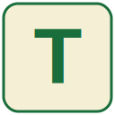

#  Tile Tactics

Welcome to Tile Tactics, an advanced Scrabble analysis and training platform designed to help players improve their game through strategic move evaluation and intelligent practice.

🌐 **Live at: [tiletactics.com](https://tiletactics.com)**

## 🎯 Overview

Tile Tactics provides powerful tools for Scrabble players to analyze positions, discover optimal plays, and sharpen their skills against a formidable AI opponent. With sophisticated evaluation algorithms and comprehensive word finding capabilities, it's your complete toolkit for Scrabble mastery.

**Why Tile Tactics?**
* 🧠 Find strategically optimal moves, not just high scoring ones
* 🤖 Practice against an extremely challenging AI opponent
* ⚡ Instant word discovery from any set of tiles
* 📚 Support for multiple official dictionaries

## ✨ Key Features

### Board Analysis
* Enter any board position and rack to discover the best moves
* Advanced evaluation considers multiple strategic factors:
  - **Score**: Base points including multipliers
  - **Leave Quality**: Tile synergy and rack balance
  - **Board Position**: Centre control and premium square access
  - **Defence**: Limiting opponent opportunities
  - **Volatility Management**: Strategic tile deployment
* Analysis completes in just a few seconds
* Recommendations adapt based on game stage (early/mid/endgame)

### vs TileTacticsAI
* Challenge yourself against an intelligent AI opponent
* Full game implementation with all standard rules
* Features tile exchanges, passing, and resignation options
* Real-time score tracking
* AI uses strategic evaluation for realistic, high-level play

### Word Finder
* Enter your tiles to discover every possible valid word
* Near-instant results organised by word length
* Clear indication of blank tile positions
* Support for multiple dictionaries:
  - CSW24 (Collins Scrabble Words)
  - NWL2023 (NASPA Word List)
* Perfect for learning new words and expanding vocabulary

## 💻 Tech Stack

* **Frontend:** React + JavaScript
* **Backend:** Go (compiled to WebAssembly)
* **Deployment:** Fully client-side - no server required due to WebAssembly

## 🚀 Performance

* **Board Analysis:** Evaluates thousands of possible moves in seconds
* **Word Finding:** Near-instant results for any tile combination
* **Zero Latency:** All computation runs locally in your browser via WebAssembly

